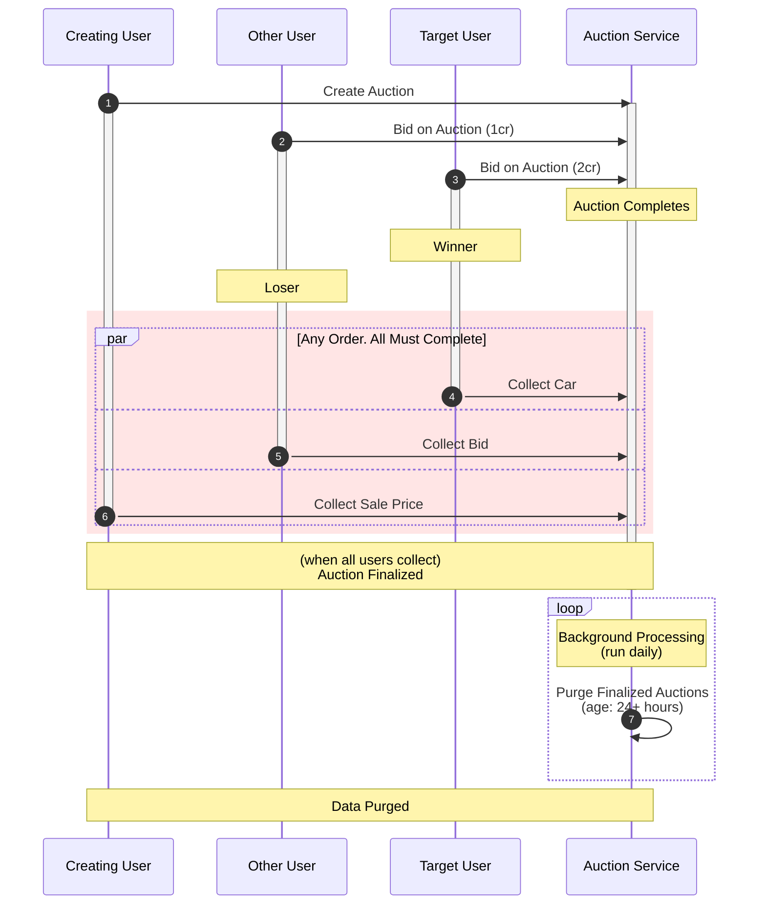

# Stored data afterward
- auction id
- seller
- closing bid

# Wants
- Bid History
  - Who
  - How Much?
  - Buyout?
- Winners/losers/etc
- How much they paid?
- What they got?

# Timeline Proposal
- On All
  - (Index) Correlation ID of some sort (Auction ID?)
  - (Index) Who?
  - (Index) Date
  - Value / How Much?
  - Item?
- Auction Created
  - Starting Bid
  - Buyout Price (if available)
- Someone Bid (many such entries)
  - How much did they have *before/after* the bid?
  - Who *was* the leader?
  - Are they now the leader? (data consistency check)
- Buyout
  - How much did they pay?
  - How much did they have *before/after* the buyout?
- Auction Completed
  - Was it a buyout?
- Auction Collection
  - Winner? Loser? Creator?
  - What did they collect?
- Auction Finalized
  - What data got nuked?