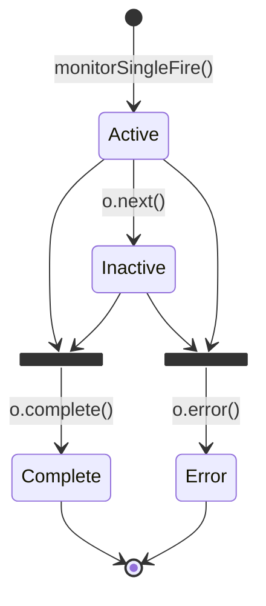
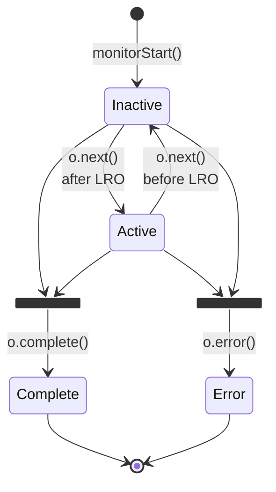
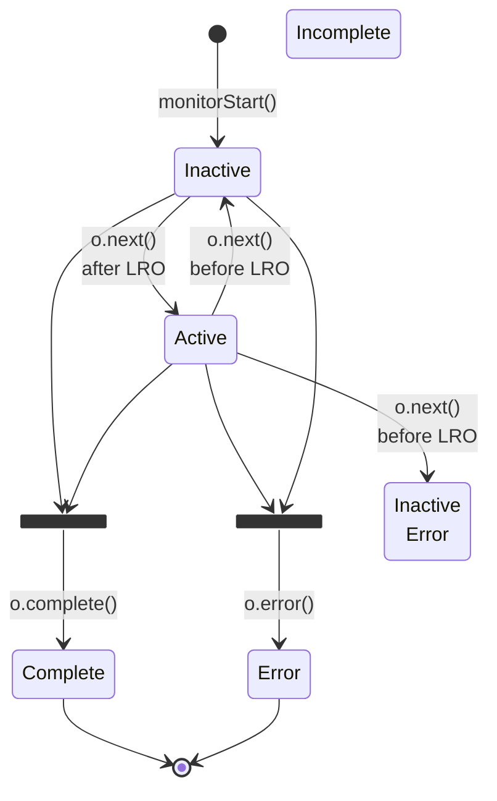

# Single Fire

```mermaid
stateDiagram-v2
  [*] --> Active: monitorSingleFire()
  state complete_join <<join>>
  state error_join <<join>>
  Active --> Inactive: o.next()
  Inactive --> error_join
  Active --> error_join
  Active --> complete_join
  Inactive --> complete_join
  complete_join --> Complete: o.complete()
  error_join --> Error: o.error()
  Complete --> [*]
  Error --> [*]
```

# Multi-fire; stop-on-error

```mermaid
stateDiagram-v2
  [*] --> Inactive: monitorStart()
  state complete_join <<join>>
  state error_join <<join>>
  Active --> Inactive: o.next()<br>before LRO
  Inactive --> Active: o.next()<br>after LRO
  Active --> error_join
  Inactive --> error_join
  Inactive --> complete_join
  Active --> complete_join
  complete_join --> Complete: o.complete()
  error_join --> Error: o.error()
  Complete --> [*]
  Error --> [*]
```

# Multi-fire; continue-on-error

```mermaid
stateDiagram-v2
  [*] --> Inactive: monitorStart()
  state complete_join <<join>>
  state error_join <<join>>
  Error: Error
  Active: Active
  Complete: Complete
  Incomplete: Incomplete
  InactiveError: Inactive<br>Error
  Active --> Inactive: o.next()<br>before LRO
  Active --> InactiveError: o.next()<br>before LRO
  Inactive --> Active: o.next()<br>after LRO
  Active --> error_join
  Inactive --> error_join
  Inactive --> complete_join
  Active --> complete_join
  complete_join --> Complete: o.complete()
  error_join --> Error: o.error()
  Complete --> [*]
  Error --> [*]
```
