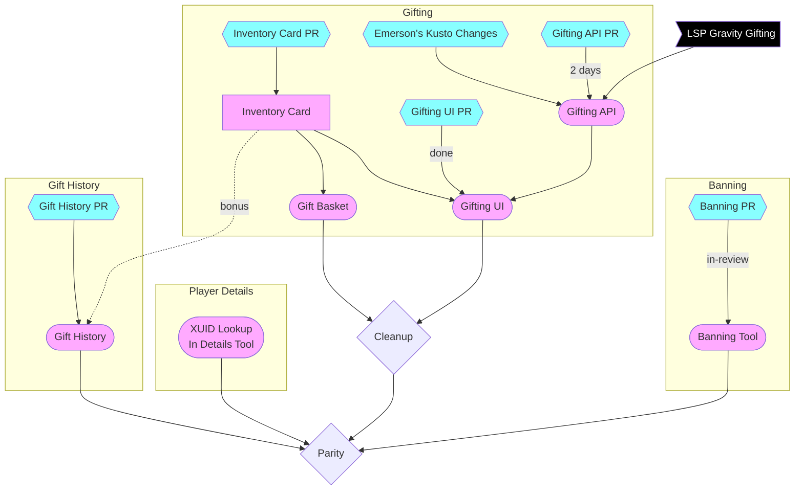

```mermaid
graph TD
  LSP_Gravity_Gifting>LSP Gravity Gifting]

  subgraph BanningCat[Banning]
    Banning_PR{{Banning PR}}
    Banning([Banning Tool])
  end

  subgraph PlayerDetailsTool[Player Details]
    Player_Details_Xuid_lookup([XUID Lookup<br/>In Details Tool])
  end

  subgraph Gifting[Gifting]
    Inventory_Card_PR{{Inventory Card PR}}
    Inventory_Card[Inventory Card]
    Gift_Basket([Gift Basket])
    Gifting1([Gifting API])
    Gifting_PR{{Gifting UI PR}}
    Kusto_Query{{Emerson's Kusto Changes}}
    Gifting_PR2{{Gifting API PR}}
    Gifting2([Gifting UI])
  end
  subgraph GiftHistoryCat[Gift History]
    Gift_History_PR{{Gift History PR}}
    Gift_History([Gift History])
  end
  Cleanup1{Cleanup}
  Parity{Parity}

  Gift_History_PR --> Gift_History
  Inventory_Card_PR --> Inventory_Card
  Inventory_Card -.bonus.-> Gift_History
  Gift_History --> Parity
  Inventory_Card --> Gifting2
  Kusto_Query --> Gifting1
  Gifting_PR --done--> Gifting2
  Gifting_PR2 --2 days--> Gifting1
  LSP_Gravity_Gifting --> Gifting1
  Inventory_Card --> Gift_Basket
  Gift_Basket --> Cleanup1
  Gifting1 --> Gifting2
  Gifting2 --> Cleanup1
  Player_Details_Xuid_lookup --> Parity
  Cleanup1 --> Parity
  Banning_PR --in-review--> Banning
  Banning --> Parity

  %% PRs
  style Gifting_PR2 fill:#8ff
  style Gifting_PR fill:#8ff
  style Banning_PR fill:#8ff
  style Kusto_Query fill:#8ff
  style Gift_History_PR fill:#8ff
  style Inventory_Card_PR fill:#8ff

  %% external deps
  style LSP_Gravity_Gifting fill:#000,color:#fff

  %% feature sets
  style Gift_Basket fill:#faf
  style Gifting1 fill:#faf
  style Gifting2 fill:#faf
  style Banning fill:#faf
  style Inventory_Card fill:#faf
  style Gift_History fill:#faf
  style Player_Details_Xuid_lookup fill:#faf
```
